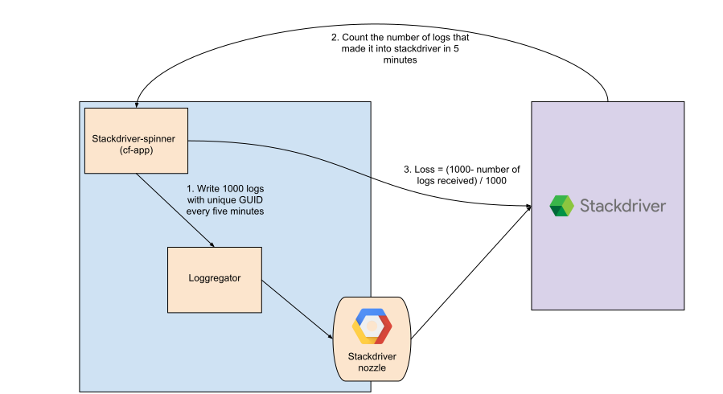

# stackdriver-spinner

stackdriver-spinner is a companion cf app to Stackdriver nozzle which is used to measure its reliability. It periodically logs a set of unique messages to loggregator and waits for them to reach Stackdriver via the nozzle. If any logs are lost in between, the loss ratio is published
to Stackdriver Logging.

## Design

1. stackdriver-spinner logs `SPINNER_COUNT` number of logs with the payload being a unique GUID. These logs will then eventually make it to Stackdriver via loggregator->Stackdriver nozzle.
1. It waits for `SPINNER_WAIT` time. This wait is to give time to nozzle to process and ship the logs to Stackdriver.
1. It then polls the Stackdriver logging API for the unique GUID and counts the number of these logs. The expectation is that logs are in Stackdriver within `SPINNER_WAIT` time.
1. It then calculate the loss by `(SPINNER_COUNT - count of received logs) / SPINNER_COUNT`
1. The loss is sent directly to Stackdriver via the logging API. This can be used to setup log based metrics and alerts.

`SPINNER_COUNT` and `SPINNER_WAIT` default to `999` and `300` seconds respectively. They
can be tweaked by editing the `manifest.yml`.

## Instructions to run stackdriver-spinner
1. Add the target GCP project in `./manifest.yml`.
1. The GCP project will need a service account with log reader and writer permissions.
1. The JSON key for this service account should be stored in `./credentials.json`.
1. Make sure that you are logged into cf and have targeted the desired org and space.
1. Push this app to target cloudfoundry by `cf push`.
1. Search for "Loss: " in the stackdriver logging platform. You should be able to see the loss measurement on a scale from 0 to 1 (1 representing complete loss of logs).

## gcloud CLI tips and tricks
